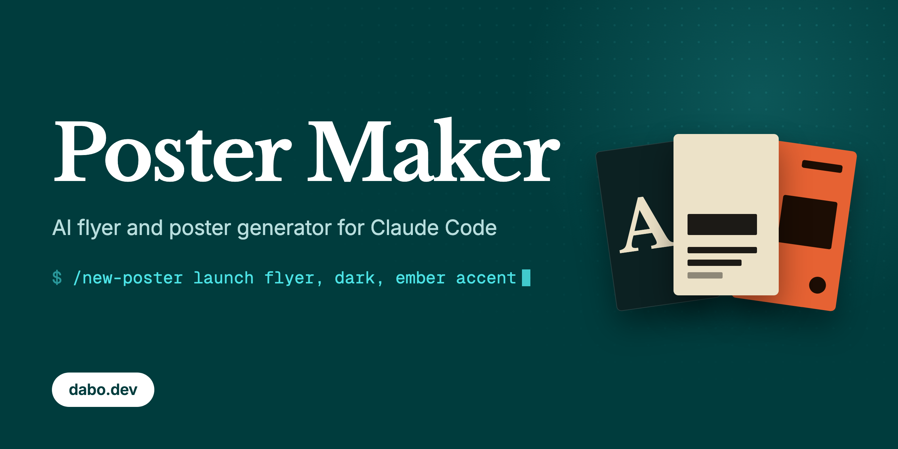
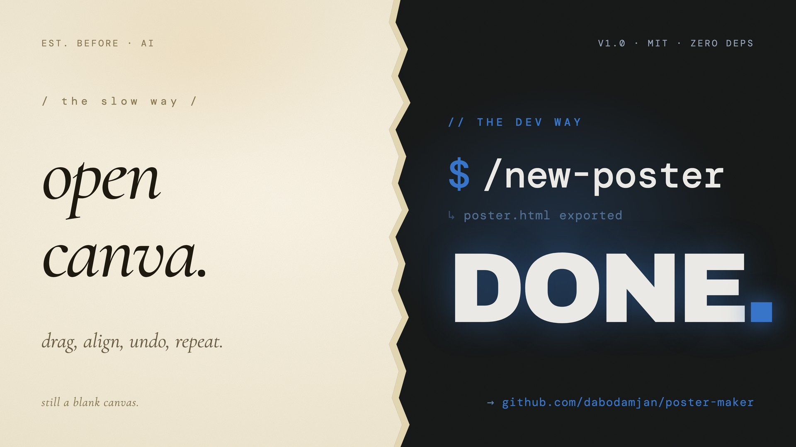
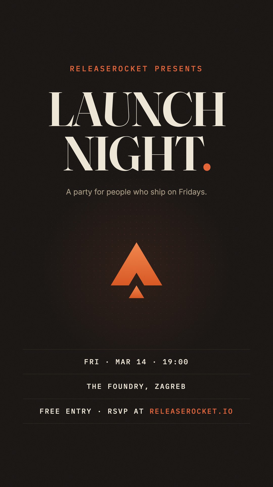
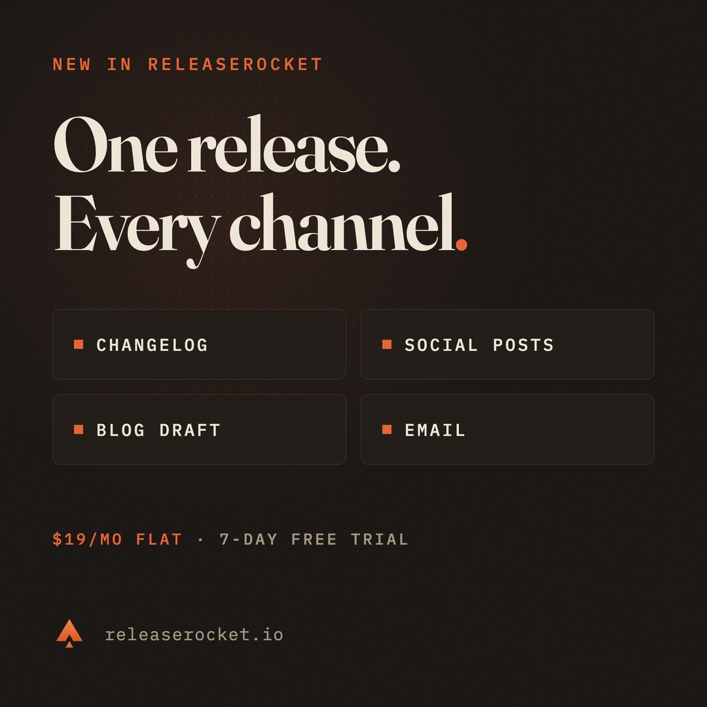
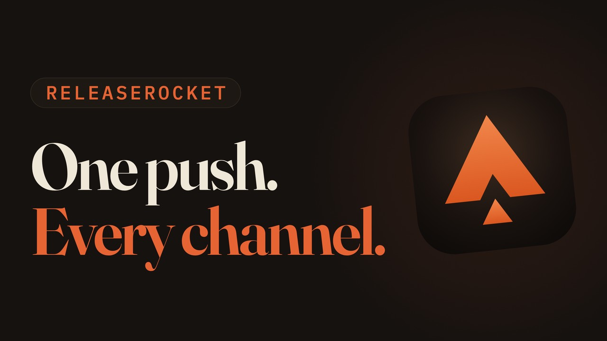
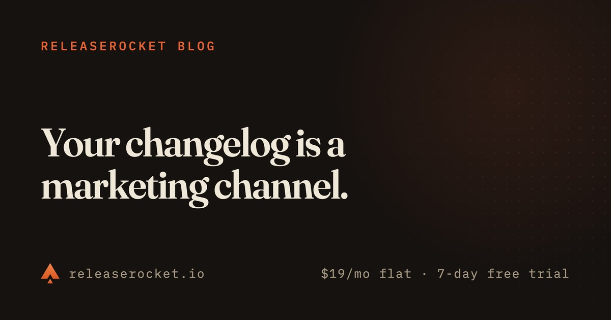
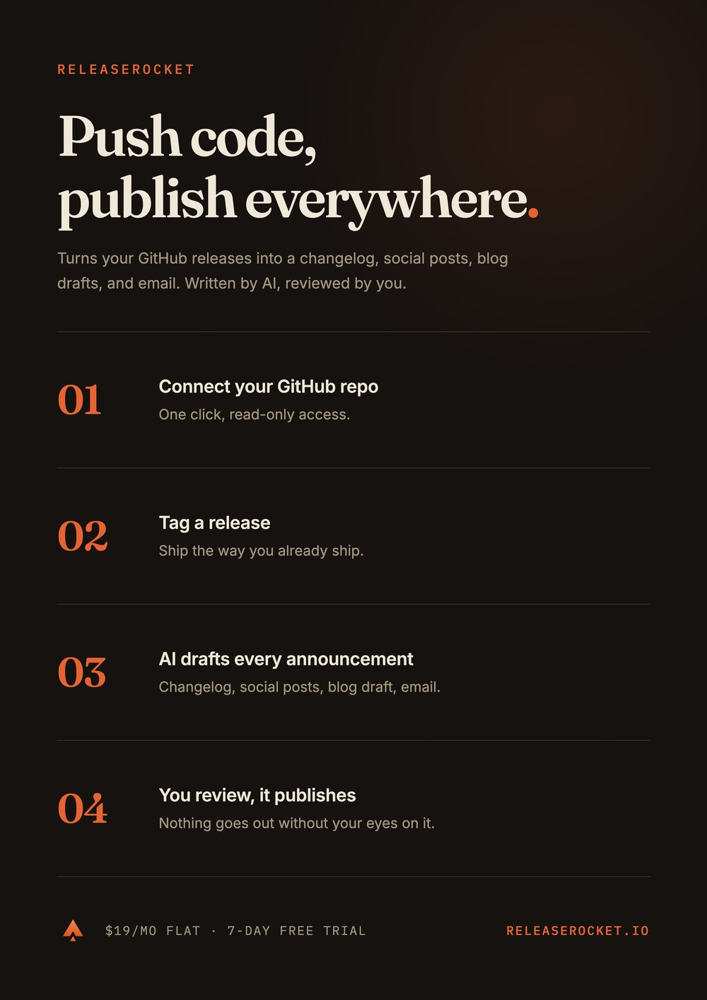
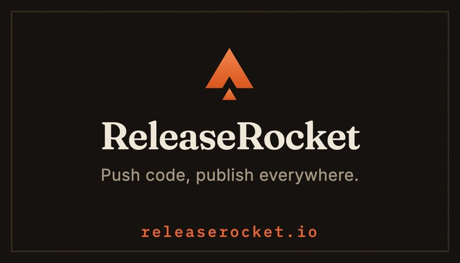
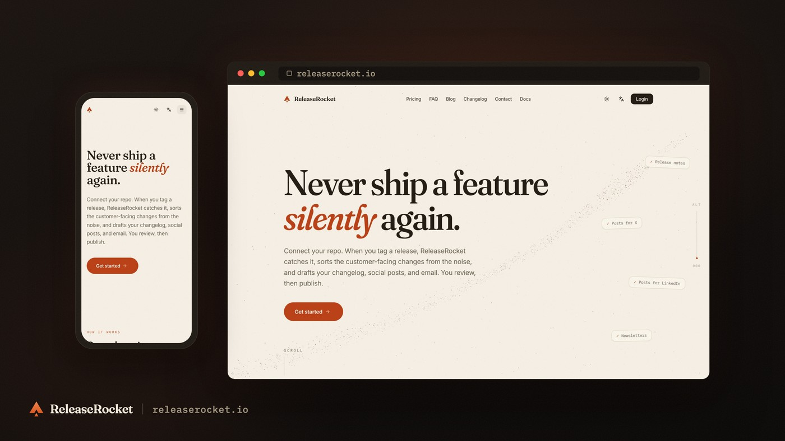

# Poster Maker: AI flyer and poster generator for Claude Code

Describe a flyer, poster, or social media graphic in [Claude Code](https://claude.com/claude-code) and get an editable HTML/CSS file you can export to a high-res PNG or PDF. No Figma, no Photoshop, no Canva. Just describe what you want.

## What you can make

Event flyers, Instagram Stories and posts, product launch posters, conference posters, app icons, GitHub social previews, and print posters. Every design is code: the headline stays real text, and spacing, colors, and type sizes stay editable CSS.



*A self-referential example, made with Poster Maker. Source: [`posters/poster-maker-dev-way.html`](posters/poster-maker-dev-way.html)*

The rest of the gallery markets [ReleaseRocket](https://www.releaserocket.io/), my SaaS: real brand, real product copy, every design a single HTML file in this repo.

| Example | Preview | Source |
|---|---|---|
| Event flyer, 1080x1920 Instagram Story |  | [`releaserocket-event-flyer.html`](posters/releaserocket-event-flyer.html) |
| Instagram post, 1080x1080 |  | [`releaserocket-instagram-post.html`](posters/releaserocket-instagram-post.html) |
| YouTube thumbnail, 1280x720 |  | [`releaserocket-youtube-thumbnail.html`](posters/releaserocket-youtube-thumbnail.html) |
| Blog cover / OG image, 1200x630 |  | [`releaserocket-blog-cover.html`](posters/releaserocket-blog-cover.html) |
| A4 print poster, 210x297 mm |  | [`releaserocket-a4-poster.html`](posters/releaserocket-a4-poster.html) |
| Business card, 3.5x2 in |  | [`releaserocket-business-card.html`](posters/releaserocket-business-card.html) |
| App icon, 1024x1024 transparent |  | [`releaserocket-app-icon.html`](posters/releaserocket-app-icon.html) |
| Device showcase from a live site, 1920x1080 |  | [`releaserocket-device-showcase.html`](posters/releaserocket-device-showcase.html) |

## Quickstart

You need:

- [Claude Code](https://claude.com/claude-code)
- Git and [Node.js](https://nodejs.org/) 18 or newer
- Python 3 with pip, only if you want to remove image backgrounds

Everything works out of the box on macOS; for Linux and Windows see the FAQ below.

Fork the repository on GitHub if you want your own copy to commit posters to, then clone your fork. Or clone it directly:

```bash
git clone https://github.com/dabodamjan/poster-maker.git
cd poster-maker
claude
```

Then run:

```text
/setup
```

`/setup` checks Node.js, installs the npm dependencies, downloads the Playwright Chromium browser, then exports two of the included ReleaseRocket examples to `exports/` to verify everything works.

## Make a poster or flyer

Run `/new-poster` with the content, mood, colors, images, and format you want:

```text
/new-poster DJ gig flyer for "SOLAR FREQUENCIES" at Club Elysium, bright euphoric EDM style
```

More examples:

```text
/new-poster product launch for a fitness app, clean modern, neon green accent
```
```text
/new-poster conference talk poster for "Building with AI" by Jane Smith, minimal corporate
```
```text
/new-poster 1024x1024 app icon for MyApp, use assets/myapp/logo.png, subtle glow, transparent background
```

The command first confirms whether the design is for social media or print. Claude then writes one HTML file to `posters/`, opens it in your browser, renders a preview with Playwright, and checks the screenshot. The default format is a 1080x1920 Instagram Story.

Poster design leans on the model's taste. Run Claude Code with the most capable model available to you (Claude Fable 5 at the time of writing): layout and typography quality track the model tier directly.

## Iterate

Ask for changes in plain language:

- *"make the title bigger"*
- *"darker, more contrast"*
- *"try a different font"*
- *"add a glow effect"*
- *"make it feel more underground"*

Claude updates the same HTML file, takes another screenshot, checks the layout, and shows you the result.

## Use your own images

Drop photos, logos, or product images into `assets/` and mention their paths:

```text
/new-poster event poster, use assets/my-event/photo.jpg as background, dark moody style
```

Need to cut someone out of a photo?

```text
/remove-bg assets/my-event/photo.jpg
```

The command uses Python with `rembg` and Pillow. If `rembg` is missing, the command asks before installing the dependencies. The result is saved beside the original as `photo-nobg.png`.

## Put a live website in a poster

```bash
node scripts/screenshot-url.js https://yoursite.com mysite
```

This captures the page at real device viewports into `assets/mysite/`: desktop (1440x900) and mobile (390x844) by default, both at 2x, with presets for tablet and full HD and custom sizes via `--viewport name:WxH`. The browser launches with the GPU forced on, so WebGL and Three.js pages render their canvas instead of a blank fallback.

Drop the shots into the device-showcase example: copy [`posters/releaserocket-device-showcase.html`](posters/releaserocket-device-showcase.html), repoint its two image paths, change the address-bar text and wordmark, and export. The file's header comment walks through the whole swap.

For a quick social-ready card from any screenshot, there is also:

```bash
node scripts/frame-screenshot.js --input shot.png --size 16:9
```

It centers the image on a 16:9, 4:5, or 1:1 canvas with a drop shadow, and samples the screenshot's own edge color for the background so the frame always matches.

## Export

Pass `/export-poster` the name of an HTML file in `posters/`:

```text
/export-poster releaserocket-event-flyer.html
```

The command asks whether you want PNG or PDF:

- PNG is the default. Playwright renders pixel-sized posters at 2x device scale, so a 1080x1920 flyer produces a 2160x3840 PNG. Physical-unit posters render at 4x, see the print note below.
- PDF is also available, with backgrounds included. Posters sized in mm or inches get a true physical page size.

Exports land in `exports/`. Run `/export-poster` without a filename and it lists the posters and lets you pick one.

## Formats

| Format | Size | Notes |
|---|---|---|
| `story` | 1080x1920 px | Default. Instagram Story template, 9:16 |
| `square` | 1080x1080 px | Instagram post, 1:1 |
| `landscape` | 1920x1080 px | YouTube-friendly 16:9 |
| `github` | 1280x640 px | GitHub social preview, 2:1 |
| `og` | 1200x630 px | Blog cover and social link preview |
| `youtube` | 1280x720 px | YouTube thumbnail |
| `a4` | 210x297 mm | Print, see the print note |
| `a3` | 297x420 mm | Print, see the print note |
| `business-card` | 3.5x2 in | Print, see the print note |
| Custom | any `WxH` in px | For example `1024x1024` |

**Print note:** posters sized in physical units in the body CSS (`width: 210mm`, `width: 3.5in`, cm works too) export as PDFs with the true physical page size and as PNGs at 4x device scale, which is 384 DPI. Pixel-sized posters export at 2x.

## How it works

Each poster is a single HTML file in `posters/` with all CSS inline. No frameworks, no build step. Claude uses Google Fonts for typography and pure CSS for everything else: gradients, glow effects, grain textures, blend modes, and image compositing. Posters can reference images from `assets/`.

The HTML body defines the poster dimensions. A small fit-to-window script scales the design to your browser window for previews without affecting the export.

For exports, [Playwright](https://playwright.dev/) launches headless Chromium, reads the body dimensions from the HTML, waits for fonts to load, disables the preview scaling, and captures a PNG (2x device scale, 4x for physical-unit posters) or a PDF. A transparent PNG is produced when the body CSS declares `background: transparent`.

All the design knowledge, including font pairings, color palettes, layout rules, and Instagram safe zones, lives in [`.claude/commands/`](.claude/commands/) and `CLAUDE.md`. Tweak them to match your own style. That is the part no template editor gives you: the design system itself is plain text you can edit.

## Limitations

- There is no GUI or drag-and-drop canvas. You edit through prompts or directly in HTML and CSS.
- Claude Code requires a paid subscription or API budget.
- Google Fonts load over the network when a poster renders. For offline use, provide local font files and the CSS yourself.
- The slash commands use the macOS `open` command to show previews. On Linux or Windows, replace that step with your platform's equivalent.
- Output quality depends on the model, your prompt, your assets, and your review.

## Poster Maker vs Canva, Figma, and AI image generators

### Poster Maker vs Canva and Figma

Poster Maker fits when you would rather describe the design in Claude Code, keep the source in Git, and edit it as HTML/CSS. Canva fits when you want a visual template editor with a stock asset library that non-technical teammates can edit. Figma fits when you need manual control, design systems, and live collaboration.

### Poster Maker vs DALL-E and Midjourney

Poster Maker produces exact, editable text and layout as code: a headline stays text you can change without redrawing the whole composition. AI image generators produce raster images, which is great for illustrations and photo-like artwork. The two combine well: generate artwork, put it in `assets/`, and use it inside a Poster Maker layout.

### Poster Maker vs Satori and og-image

Poster Maker is an authoring workflow: Claude designs and revises individual posters in a conversation. Satori and og-image are libraries for generating images from markup programmatically, which fits templated pipelines like producing an OG image for every blog post.

## FAQ

### How do I make an event flyer with AI?

Clone the repository, run `/setup`, then describe the event with `/new-poster`: title, date, venue, style, colors, and any image paths. Review the preview, ask for changes in plain language, and export the finished flyer as PNG or PDF.

### Can I use this for Instagram posts?

Yes. Ask for `square` for a 1080x1080 post or `story` for a 1080x1920 Story. The Story rules keep important content away from Instagram's interface areas at the top and bottom.

### Is Poster Maker free?

Yes. Poster Maker is free and open source under the MIT license. Claude Code is a separate product and needs a paid subscription or API budget.

### Does Poster Maker work on Windows or Linux?

The rendering and exports run anywhere Playwright runs. The slash commands assume macOS in one spot: they call `open` to show results, so on Linux or Windows tell Claude to use `xdg-open` or `start` instead.

### Do I need design skills?

No. You describe what you want and give feedback in plain language. The design principles built into the commands handle typography, hierarchy, and color. You still review the result, especially for print.

## Who made this

I'm [Damjan Dabo](https://dabo.dev/), an indie developer based in Croatia. You can find me on [X](https://x.com/DamjanDabo) and [LinkedIn](https://www.linkedin.com/in/damjan-dabo/).

I also build [ReleaseRocket](https://www.releaserocket.io/), which turns GitHub releases into announcements across every channel. Its real marketing runs through this tool, which is why the examples carry the ReleaseRocket brand.

## Contributing

Contributions are welcome. See [CONTRIBUTING.md](CONTRIBUTING.md) and the [code of conduct](CODE_OF_CONDUCT.md), and report security issues per [SECURITY.md](SECURITY.md).

## License

[MIT](LICENSE)
